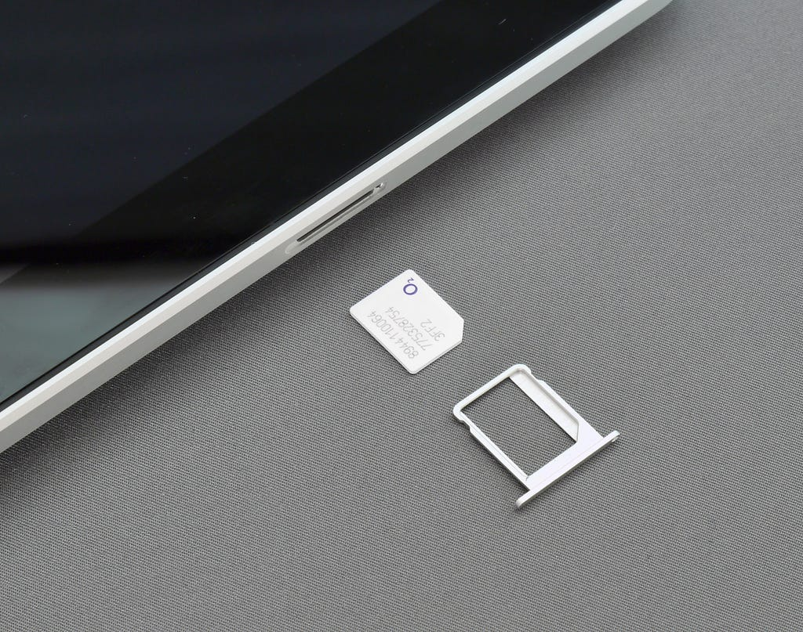
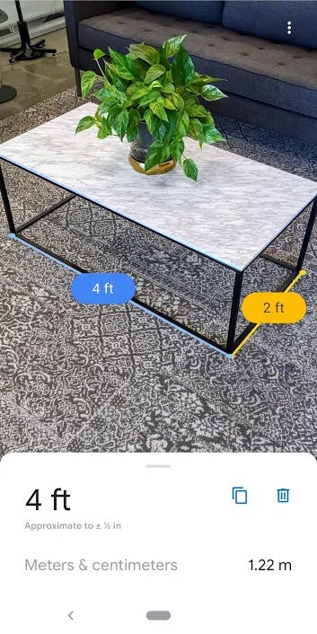
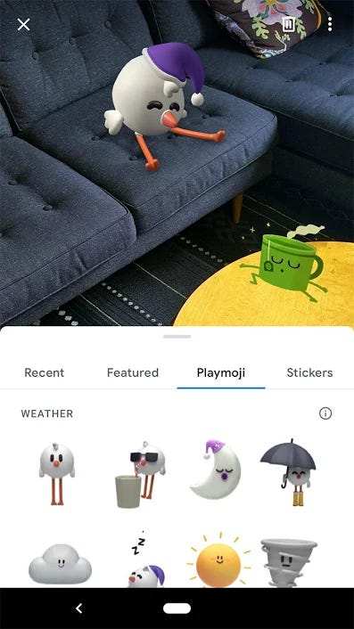

There are many useful features that are not available in all smartphones, especially cheap (budget) smartphones, like eSIM, HDR playback, ARCore, etc. Let’s talk about four of them.

## eSIM

Photo by <a href="https://unsplash.com/@brett_jordan">Brett Jordan</a> on&nbsp;<a href="https://unsplash.com/">Unsplash</a>

An embedded-SIM (eSIM) or embedded universal integrated circuit card (eUICC) is a form of programmable SIM card that is embedded directly into a device.

One of the main advantages of eSIM is that it enables users to change operators remotely, straight from their phone, without having to acquire a new SIM card. eSIM is embedded directly into a device so when someone steals your phone you can always track your device. It also allows people to store multiple profiles on a single device, effectively having two or more numbers, and switch between them.

While eSIM devices could be highly beneficial for mass-produced devices, they are not without their flaws. The first problem that needs to be addressed is the transfer of the credentials into a different device. SIM cards are designed to not be easily copied and not to be remotely accessed. This means that, if a user’s phone breaks and they want to transfer their details to a new phone, they only need to physically transfer the SIM, itself.

## ARCore

ARCore is Google’s platform for building augmented reality experiences. Using different APIs, ARCore enables your phone to sense its environment, understand the world and interact with information.

ARCore uses three key capabilities to integrate virtual content with the real world as seen through your phone’s camera:

> **Motion tracking** allows the phone to understand and track its position relative to the world.

> **Environmental understanding** allows the phone to detect the size and location of all types of surfaces: horizontal, vertical and angled surfaces like the ground, a coffee table or walls.

> **Light estimation** allows the phone to estimate the environment’s current lighting conditions.

There are many useful apps like..

## Measure App

The app is built on ARCore and can measure real-life things by using the phone’s camera.

## Playground AR Stickers

Using the phone’s camera, you can drop the animated stickers on real-world objects and have fun.

But most smartphones don’t support ARcore. You check your device can support ARCore by this [link](https://developers.google.com/ar/discover/supported-devices).

## NFC

Near-field communication (NFC) is a set of communication protocols for communication between two electronic devices over a distance of 4 cm (1​1⁄2 in) or less. NFC offers a low-speed connection with simple setup that can be used to bootstrap more-capable wireless connections.

## Applications

> NFC can be used for social networking, for sharing contacts, text messages and forums, links to photos, videos or files and entering multiplayer mobile games.

> NFC-enabled devices can act as electronic identity documents and keycards. NFC’s short range and encryption support make it more suitable than less private RFID systems. You can unlock your car with NFC.

> Google introduced platform support for secure NFC-based transactions through Host Card Emulation (HCE), for payments, loyalty programs, card access, transit passes and other custom services. HCE allows any Android 4.4 app to emulate an NFC smart card, letting users initiate transactions with their device. You can do all things which an ATM card can do without an ATM card.🤑

## Android Security Bulletin ( Security Patch )

Software updates and mobile security patches are important for your mobile devices because they help in repairing security holes and removing outdated features and adding new ones. Software updates usually cover any security holes and provide software patches to prevent hacking attacks. Mobile security is therefore important for all our mobile phones, even the most commonly used Android phones.

Why is this so important? You can read this XDA article which talks about one big vulnerability..

[**https://www.xda-developers.com/mediatek-su-rootkit-exploit/**](https://www.xda-developers.com/mediatek-su-rootkit-exploit/)

But the problem is in India every month companies launch 5–10 new smartphones so it is very difficult to maintain so many smartphones so they skip Security Patch. Many smartphones don’t receive any patches for many months. There some companies like Samsung, Nokia and OnePlus etc. They provide these patches but there also companies like Redmi, Vivo, Oppo, etc. They don’t care about security of your smartphones.

Thank you for reading🙂.

All sources and references found [here](https://docs.google.com/document/d/1jjbSyxgDUzlJwn9nXFaw8QRgbF5W_5jzAOcQxRhklHo/edit?usp=sharing).
