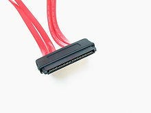
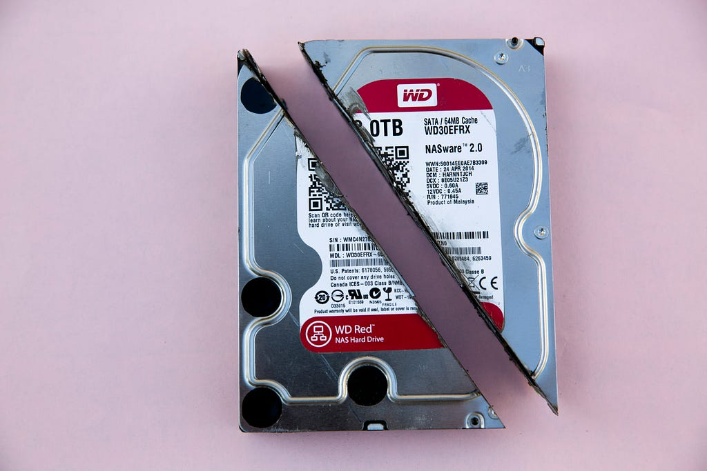
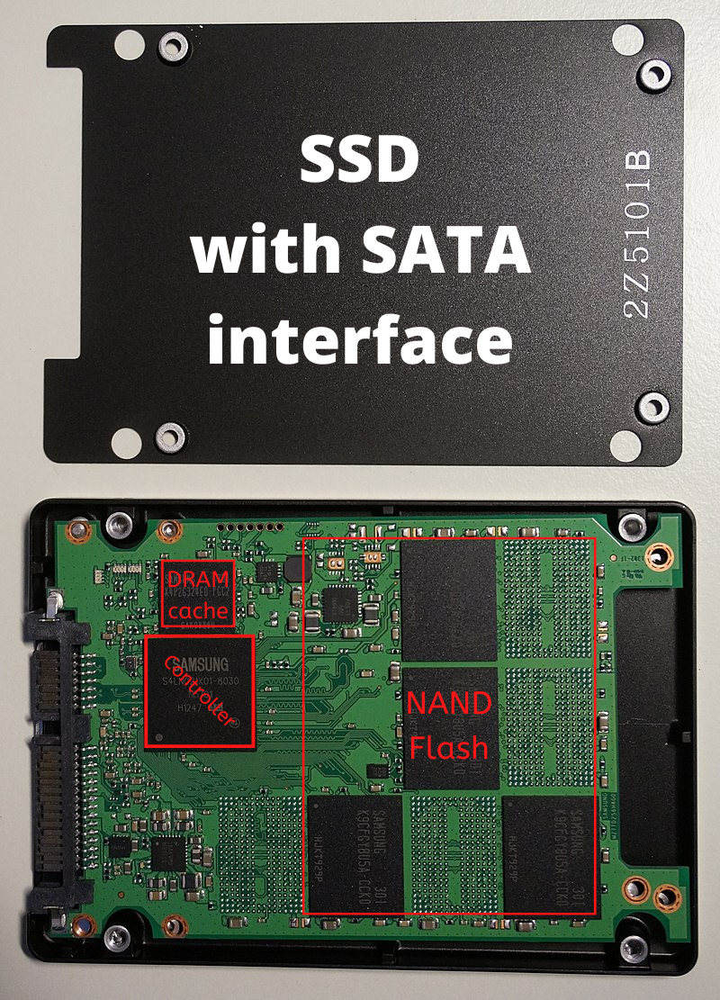

## Types of Storage by Hardware

### A) Magnetic storage devices

- Floppy disc
- Hard drive
- Magnetic strip

### B) Optical storage devices

- Blu-ray disc
- CD-ROM disc
- DVD-R, DVD+R, DVD-RW, and DVD+RW disc

### C) Flash memory devices

- USB flash drive, jump drive, or thumb drive
- Memory card

We don’t talk more about this.

## Types of Storage by Interface Protocol

### A) NVMe

NVM Express

NVM Express (NVMe) or Non-Volatile Memory Host Controller Interface Specification (NVMHCIS) is an open logical device interface specification for accessing non-volatile storage media attached via a PCI Express (PCIe) bus.

**Q. Why NVMe ?**

\->SATA was designed primarily for interfacing with mechanical hard disk drives (HDDs), and it became increasingly inadequate for SSDs, which improved in speed over time. For example, within about 5 years of mass market mainstream adoption (2005–2010) many SSDs were already held back by the comparatively slow data rates available for hard drives — unlike hard disk drives, some SSDs are limited by the maximum throughput of SATA.

You can learn more about NVMe at

[https://en.wikipedia.org/wiki/NVM\_Express](https://en.wikipedia.org/wiki/NVM_Express)

[https://nvmexpress.org/](https://nvmexpress.org/)

### B) SATA

SATA

Serial ATA (SATA, abbreviated from Serial AT Attachment) is a computer bus interface that connects host bus adapters to mass storage devices such as hard disk drives, optical drives, and solid-state drives. Serial ATA succeeded the earlier Parallel ATA (PATA) standard to become the predominant interface for storage devices.

**Speed of SATA : 1.5, 3.0 and 6.0 Gbit/s**

You can learn more about SATA at

[https://en.wikipedia.org/wiki/Serial\_ATA](https://en.wikipedia.org/wiki/Serial_ATA)

### C) SAS

SAS connector

Serial Attached SCSI (SAS) is a point-to-point serial protocol that moves data to and from computer-storage devices such as hard drives and tape drives. SAS replaces the older Parallel SCSI (Parallel Small Computer System Interface, usually pronounced “scuzzy” or “sexy”) bus technology that first appeared in the mid-1980s. SAS, like its predecessor, uses the standard SCSI command set. SAS offers optional compatibility with Serial ATA (SATA), versions 2 and later. This allows the connection of SATA drives to most SAS backplanes or controllers. The reverse, connecting SAS drives to SATA backplanes, is not possible.

**Speed of SAS : 3.0, 6.0,12 and 22.5 Gbit/s**

You can learn more about SAS at

[https://en.wikipedia.org/wiki/Serial\_Attached\_SCSI](https://en.wikipedia.org/wiki/Serial_Attached_SCSI)

## What Normal Computer Users Need to Know

Nowadays, There are many terms like Hard drive, HHD, SSHD, SSD, NVMe, PCIe 4.0, PCIe 3.0 which makes so much confusion when we need to upgrade our PC or Laptops.

Photo by <a href="https://unsplash.com/@markusspiske">Markus Spiske</a> on&nbsp;<a href="https://unsplash.com/">Unsplash</a>

Let’s talk about Hard drives. If you buy laptops or PCs , many People recommend buying them with an SSD but it is always not true. You can always buy them with a good Hybrid Hard Drive (HHD) or Solid-state hybrid drive (SSHD) which has a small NAND flash to store memory maps so that it has more speed compared to many old hard drives.

Samsung SSD

Let’s talk about SSD. There are many cheap SSDs available in the market. Cheap SSDs are DRAM-less. SSDs without DRAM cache have a lower price point than other models. Most of us think SSDs without onboard DRAM are fine, why SSD needs RAM ! But there is a thing whenever your OS wants to fetch something from your SSD like a game you want to play. It needs to know where that data is physically located on the drive in order to know that your SSD keeps a map of sorts that actively tracks where everything is. Most people don’t know this but your SSD has to move your data around quite a bit so that you don’t end up with a situation where some of its flash memory cells wear out faster than the others. It’s a protective strategy called “wear leveling” on most SSDs. This data map is kept on a DRAM chip because DRAM is much much faster than NAND Flash that your SSD uses to store data. Keeping the map on DRAM also results in better performance because it’s faster speed means that the OS won’t need to wait as long as the SSD to locate the desired data. However it is obviously possible to eliminate DRAM entirely and keep this mapping data either on main memory itself or just copy it over to your system RAM after your computer turns on. SSDs without DRAM are much cheaper but cheap does not equate to good value. Sometimes SSDs without DRAM are slower than SSHD or HDD. Many DRAM-less SSDs die sooner.

## Which Storage Is Best for You?

For Laptops and PCs for boot drive it is recommended to use SSD with DRAM and storing data normal HDD is fine. Do not use DRAM-less SSDs. Mostly SSD with NVMe is fine but you can go with SATA ones.

For NAS( Network-attached storage ) HDD is fine.

For projects with raspberry or any embedded system board HDD is fine. Most people think that SSDs give more performance but it’s not ture because these types of computers use USB interfaces which are slower as compared to NVMe or SATA.

## How Do You Know Which SSD Has DRAM?

If only manufacturers actually provided technical specs instead of that garbage they call technical specs. PCPartpicker lists the cache in their storage pages. This could help you find what you are looking for easier.

[https://pcpartpicker.com/products/internal-hard-drive/#t=0](https://pcpartpicker.com/products/internal-hard-drive/#t=0)
