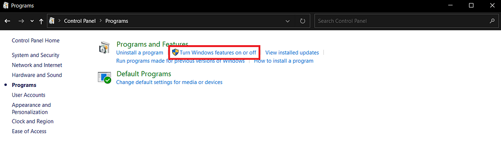
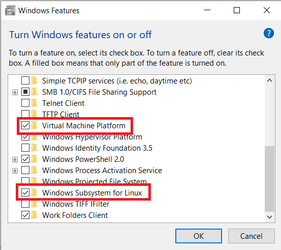
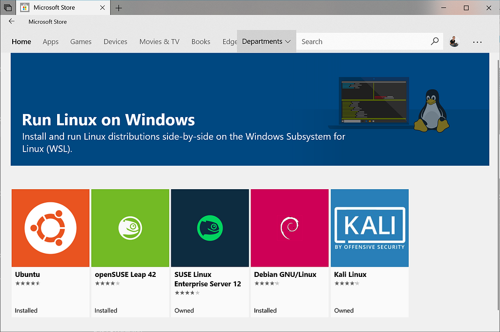
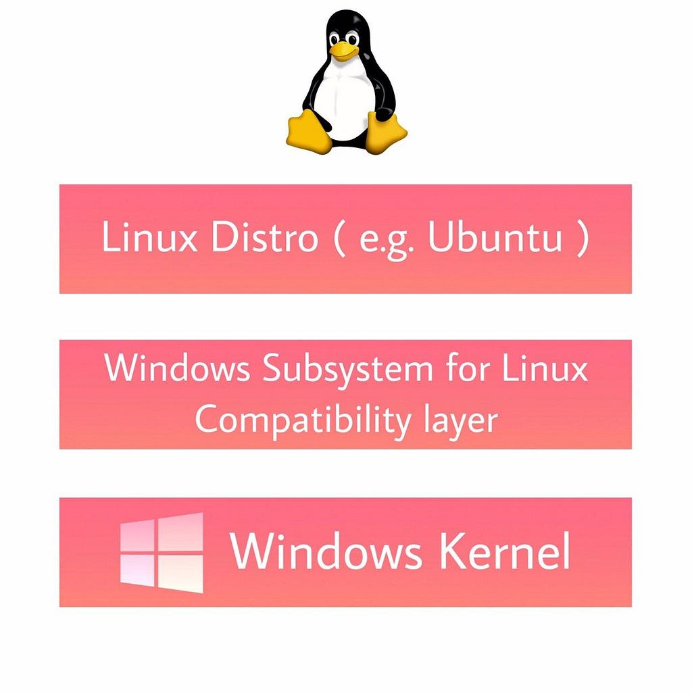
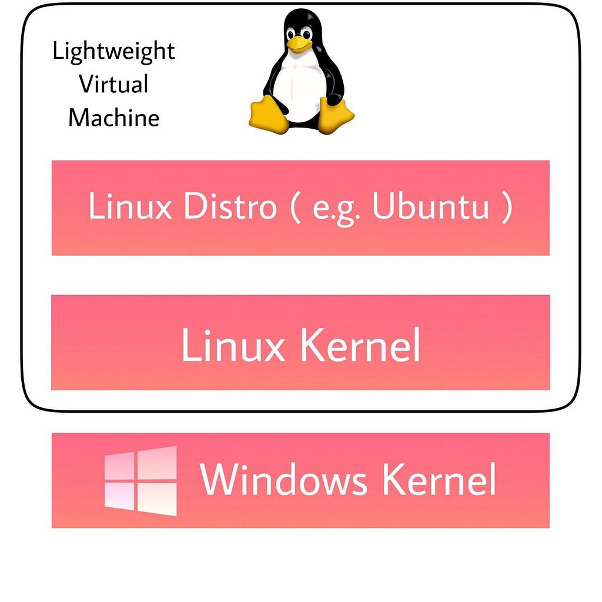
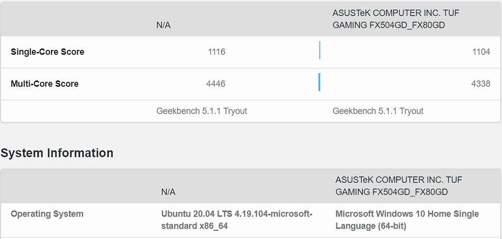
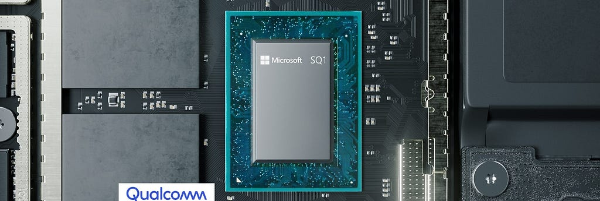

**Windows Subsystem for Linux (WSL)** is a compatibility layer for running Linux natively on Windows 10 and Windows Server 2019. With WSL we can use Linux distribution like Ubuntu, Kali Linux on Windows 10.

The technology behind Windows Subsystem for Linux originated in the unreleased [**Project Astoria**](https://en.wikipedia.org/wiki/Windows_10_Mobile#Project_Astoria), which enabled some **Android applications** to run on Windows 10 Mobile.

## Timeline

July 27, 1993 — **Microsoft POSIX subsystem,** Portable Operating System Interface (POSIX) defines the application programming interface (API), along with command line shells and utility interfaces, for software compatibility with variants of Unix and other operating systems.

February 1999 — **Windows Services for UNIX (SFU)** is a discontinued software package produced by Microsoft which provided a Unix environment on Windows NT. SFU contains over 350 Unix utilities such as vi, ksh, csh, ls, cat, awk, grep, kill, etc and GCC 3.3 compiler, includes and libraries.

November 2015 — **Project Astoria** — Microsoft had also announced an Android runtime environment for Windows 10 Mobile known as **“Astoria”**, which would allow Android apps to run in an emulated environment with minimal changes. The Windows Subsystem for Linux (that isn’t available in the Mobile version) was developed from Project Astoria.

August 2, 2016 — **Windows Subsystem for Linux (WSL)** — The first release of WSL provides a Linux-compatible kernel interface developed by Microsoft, containing no Linux kernel code, which can then run a GNU user space on top of it, such as that of Ubuntu, openSUSE, SUSE Linux Enterprise Server,Debian and Kali Linux.

June 12, 2019 — **Windows Subsystem for Linux 2 (WSL 2)** released with a Linux kernel running in a lightweight virtual machine environment.

## Installing WSL

1.  Go to **Control Panel -> Programs**



Click on **Turn Windows features on or off**



Turn on **Virtual Machine Platform & Windows Subsystem for Linux**

2\. Install distribution



You can install any distribution, here I’m using [**Ubuntu 20.04**](https://www.microsoft.com/en-in/p/ubuntu-2004-lts/9n6svws3rx71?rtc=1#activetab=pivot:overviewtab)**.**

Now Open it.

3\. Open CMD or Power shell

“wsl -l -v” will give list of distributions with versions

```
PS C:\WINDOWS\system32> wsl -l -v
NAME STATE VERSION
* Ubuntu-20.04 Stopped 1
```

To use **WSL 2** use set-version

```
PS C:\WINDOWS\system32> wsl --set-version Ubuntu-20.04 2
Conversion in progress, this may take a few minutes…
For information on key differences with WSL 2 please visit https://aka.ms/wsl2
Conversion complete.
PS C:\WINDOWS\system32> wsl -l -v
NAME STATE VERSION
* Ubuntu-20.04 Running 2
```

## WSL 1 vs WSL 2

WSL 2 is a new version of the Windows Subsystem for Linux architecture that powers the Windows Subsystem for Linux to run ELF64 Linux binaries on Windows. Its primary goals are to **increase file system performance**, as well as adding **full system call compatibility**.

**WSL 1 architecture**



**WSL 2 architecture**



A traditional VM experience can be slow to boot up, is isolated, consumes lots of resources, and requires your time to manage it. WSL 2 does not have these attributes.

WSL 2 provides the benefits of WSL 1, including seamless integration between Windows and Linux, fast boot times, a small resource footprint, and requires no VM configuration or management. While WSL 2 does use a VM, it is managed and run behind the scenes, leaving you with the same user experience as WSL 1.

**WSL 2 uses a Virtual Hardware Disk (VHD) to store your files.**

WSL 2 stores all your Linux files inside of a VHD that uses the ext4 file system. This VHD automatically resizes to meet your storage needs. This VHD also has an initial max size of 256GB.

If your distro grows in size to be greater than 256GB you will see errors stating that you’ve run out of disk space. You can fix these by expanding the VHD size.

## Linux ( Ubuntu ) vs WSL

Most technical branch students use Linux but sometimes Windows is necessary. Normally these types of people use dual boot but dual boot comes with their own problems like unstable boot, ACPI errors, drivers errors and unreliability.

But on the other hand WSL is very easy to use and doesn’t need additional processes.



We think WSL is not fast as compared to native Ubuntu but this is a myth. Comparing WSL 2 and Windows 10 in GEEKBENCH 5 benchmark test. Both have very [similar scores](https://browser.geekbench.com/v5/cpu/compare/2380105?baseline=2380066).

## What’s Next?

1.  WSL will support GPU Compute workflows so users can do ML related work in WSL
2.  WSL will add Linux GUI support
3.  DirectX is coming to the Windows Subsystem for Linux so we can play games in Linux 😁

Nowadays Windows on ARM become very popular because it offers many features like always on, long battery life, 5G and many more on ultrathin laptops and 2-in-1s. But the problem is Windows doesn’t have many ARM based software like adobe software so most of these PCs use 32bit x86 software and emulate in ARM64. It comes with a huge performance disadvantage. But on the other hand Linux has a huge number of software in ARM64. With WSL, ARM powered PCs can run android very easily. So the next gen. of Ultrabook can run Windows with Linux and Android.


<span class="image-caption">Surface Pro X with Microsoft SQ1 Processor</span>



## References

-   [Windows Subsystem for Linux - Wikipedia](https://en.wikipedia.org/wiki/Windows_Subsystem_for_Linux)
-   [What is Windows Subsystem for Linux](https://docs.microsoft.com/en-us/windows/wsl/about)
-   [The Windows Subsystem for Linux BUILD 2020 Summary | Windows Command Line](https://devblogs.microsoft.com/commandline/the-windows-subsystem-for-linux-build-2020-summary/)
